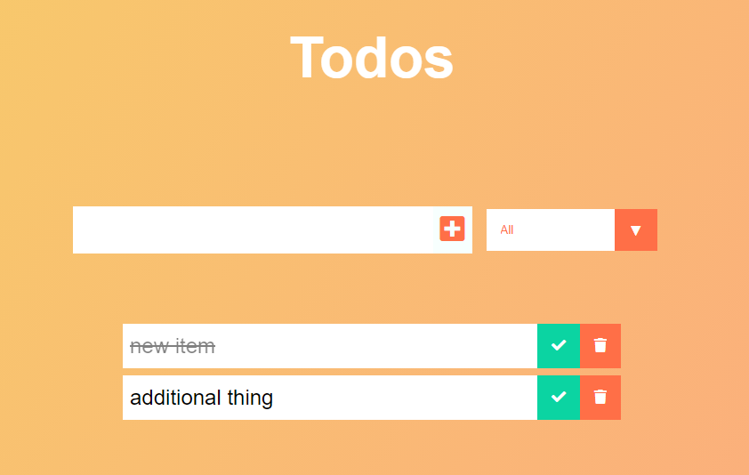

#### Todo App

This small react project was developed by 
190031925 RAYAVARAPU GOUTAM     (TEAM LEAD)
190031068 MOHAMMED SAIF AFRIDI  (TEAM MEMBER)

The project utilises React to create a simple Todo app. Todo Items are generated and rendered to the DOM on enter from the setFiltered State instead of modifying and mutating the original array of Todos during filtering. They can be updated to show they are completed/uncompleted. In addition, the user can delete an item from the todo list, removing it from the localStorage and from the project's State.

Filtering functionality is implemented and allows the user to see `all`, `complete` or `incomplete` tasks in the list.

Todos are saved to local Storage and available via the `setTodos` state. 
This web app allows you to create a list of to-dos with custom categories. The to-dos get synched to a database under your user profile. You can leave the site or logout at anytime, then log back in and your to-dos will still be there! 
 
Made this project for me to better learn React.js with the Flux pattern, as well as handling user authentication using social login APIs. Built on node.js/express/mongoDB on the back end, and React.js/Flux on the front end. 
 
Running the project 
1.Install node.js and npm 
2.https://github.com/goutam29/To-Do-List_MSWD_Project
3.Install dependencies $ npm install 
4.Start app $ npm start 
5.Go to http://localhost:3000
